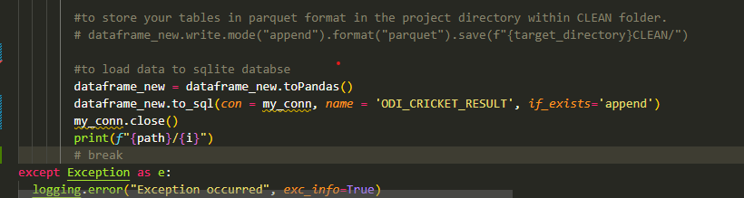

<h1>Web Data Ingestion type-Json and Data Processing Using Python & Pyspark.</h1> 
<h1>
 To Run Whole Script Please Run "run.sh"file.
</h1>

"run.sh" file will install all the dependencies and will start dataprocessing_script.py

<h2>Overview</h2>

This project automates the process of extracting data from a website using the Selenium WebDriver. It involves downloading zip files, storing them in a Download_path , extracting all the files to the landing folder of the project directory, and storing the Processed data in clean folder and sql database.

<h2>
Prerequisites[Run In Order]
</h2>
--virtual -env - python -m venv .venv
--activate virtual env = .venv\Scripts\activate.ps1
--run requirements.txt = pip install -r /content/requirements.txt
--Python (version)-3.10.11
--Selenium WebDriver-4.18.1
--Requirement txt are needed for all the dependencies.
--need Chrome Browser(For Selenium webdriver)

<h2>
[Git Link]
</h2>
Clone the repository: https://github.com/kumargautam02/Batch_pipeline_DataEngineering_task.git

<h2>
[Project Folder Structure]
</h2>
Zip_file_download_path: "C:\Users\Admin\Downloads"
Zip_file_path_inside_project_directory - "C:\Users\Admin\Downloads\Batch_pipeline_DataEngineering_task/DOWNLOAD_PATH"
landing: "C:\Users\Admin\Downloads\Batch_pipeline_DataEngineering_task/LANDING"
clean: "C:\Users\Admin\Downloads\Batch_pipeline_DataEngineering_task\CLEAN"
database_path : "C:\Users\Admin\Downloads\Batch_pipeline_DataEngineering_task\DATABASE"
database : cricket.db
table_name: ODI_CRICKET_RESULT

<h2>
[Scripts Name:]
</h2>
--__main__.py - main function to execute all the scripts
--dataprocessing_scripts.py- This Script hold all the necessary components from Ingestion to load of data in the clean file.
--data_ingestion_script.py - This script is used to Download the data from Cricksheet.org site, using selenium webdriver. 
--database_script.py - This Script will load the data to a database cricket.db, inside table - ODI_CRICKET_RESULT

<h2>
[RUN Order Of Scripts]
</h2>
<li>run.sh - This will trigger the requirements.txt file[To Install all the required dependencies] and will start  __main__.py file</li>
<li>__main__.py - This will Trigger the dataprocessing_script.py</li>
<li>dataprocessing_scripts.py - This will trigger the data_ingestion_script.py, database_script.pt</li>

<h2>
[Comments]
</h2>

In the dataprocessing_script.py, I have kept spark.save method if you want to save files locally. 

